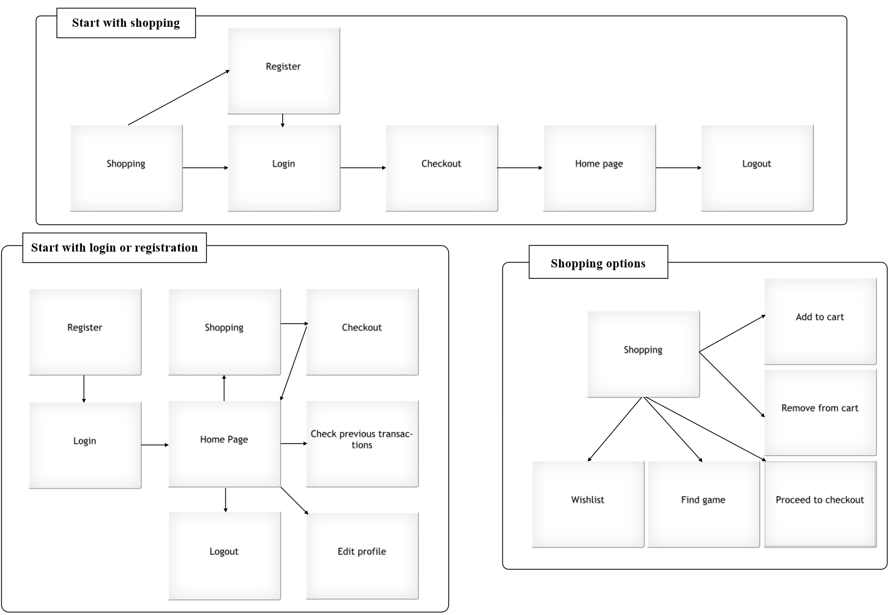

# Game-Galaxy-Backend
Backend for the Game Galaxy Project

## Project Description

Game Galaxy is an E-commerce shop where customers can buy and find the best deals for video games. The customer can login, register, and add to the cart the items they want to buy. Items can be searched through the search bar and also if they want a type of game rated on a specific field, they have the possibility to select that from the filter. Customers are able also to make their Wishlist if they want to purchase something later and see the past orders from their account. 

## Technologies Used
##Frontend Technologies

*	HTML5
*	CSS3
*	Bootstrap
*	Angular
*	TypeScript
*	JavaScript ES6

##Backend Technologies

*	Java8
*	Spring Data JPA
*	Spring MVC
*	Spring Boot
*	PostgreSQL
*	Maven
*	Embedded Tomcat Server

##DevOps Technology

You will need to create an EC2 if you will want to deploy the application on a virtual machine. In addition, you will need to install git, maven, docker, and Jenkins on EC2. 

1.	We set up the EC2 on the AWS website and install Jenkins. (https://www.jenkins.io/doc/tutorials/tutorial-for-installing-jenkins-on-AWS/)
2.	ssh into the EC2.
3.	Installing git, java, and docker on the EC2.
    *	sudo yum install git -y
    *	sudo yum install docker -y
    *	sudo yum install java-1.8.0-openjdk.
4.	Installing Maven:
    *	wget https://dlcdn.apache.org/maven/maven-3/3.8.6/binaries/apache-maven-3.8.6-bin.tar.gz
    *	tar xvf apache-maven-3.8.6-bin.tar.gz
    *	mv apache-maven-3.8.6  /usr/local/apache-maven
    *	sudo vim ~/.bashrc, press I for editing then put the exports and then press ESC and :wq got writing and saving
    *	export M2_HOME=/usr/local/apache-maven
        export M2=$M2_HOME/bin 
        export PATH=$M2:$PATH
    *	source ~/.bashrc
    *	mvn -version
5.	You load up Jenkins with EC2 IP4 address on port 8080 (check the Jenkins installing link in step 1)
6.	After you successfully enter Jenkins you need to go to Manage Jenkins and then Manage Plugins. There you will need to install the GitHub plugin.
7.	You create a job as a Freestyle project. 
    *	Select github project and put the repository link
    *	Go to Source Code Management and select Git. There you will have to put the link from the repository(the one when you want to clone it, with .git at the end).          Also, change the branch specifier in main.
    *	Build Triggers: select Git. If you want to have an automatic build every time someone pushes the code to the repository. (you will also need to set up GitHub hooks)
     *	Build: you have to copy the next code(for the first time running you don’t need the first line):
        docker rm $(docker stop $(docker ps -a -q --filter ancestor=”name-img” --format={{.ID}}))
        export MAVEN_HOME=/usr/local/apache-maven
        export PATH=$PATH:$MAVEN_HOME/bin
        mvn --version
        mvn package -Dmaven.test.skip
        docker rmi -f name-img
        docker build . -t name-img
        docker run -d -p 8087:8087 name-img
8.	Now you can access your container in your browser with your EC2 IP and the port from the last line from the last step, point d.

##Todo/Stretch goals

* Tech Support Chat
* Notifications
* Payment Plan Option
* Product Reviews
* Quantity Select
* User Reviews

## Use Case Diagram

